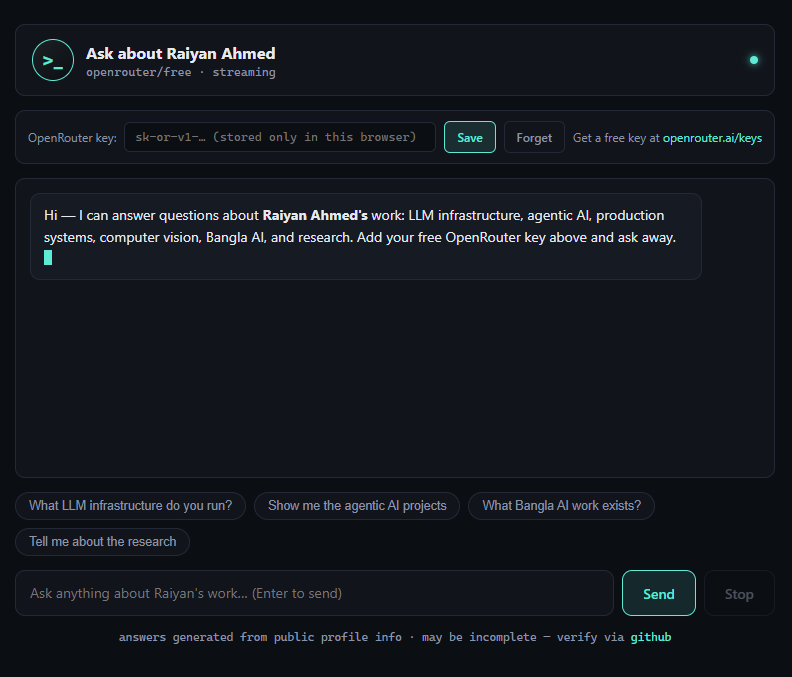
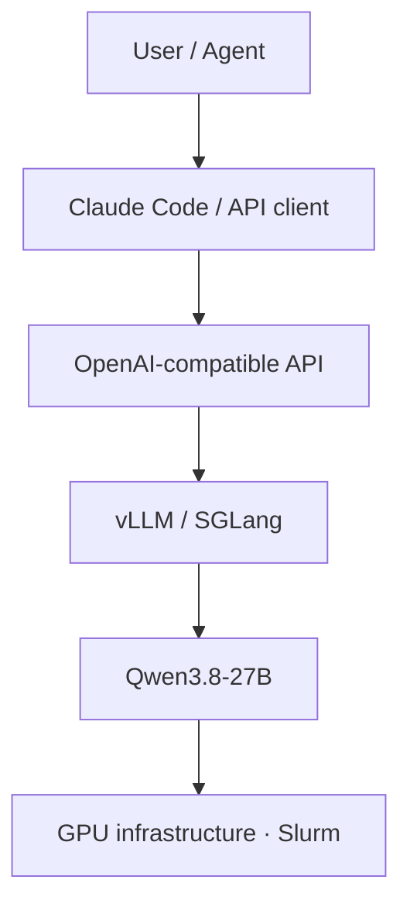
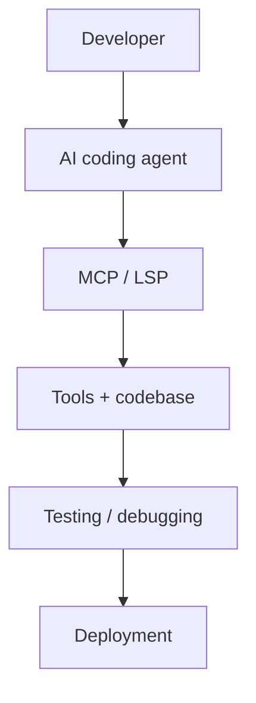
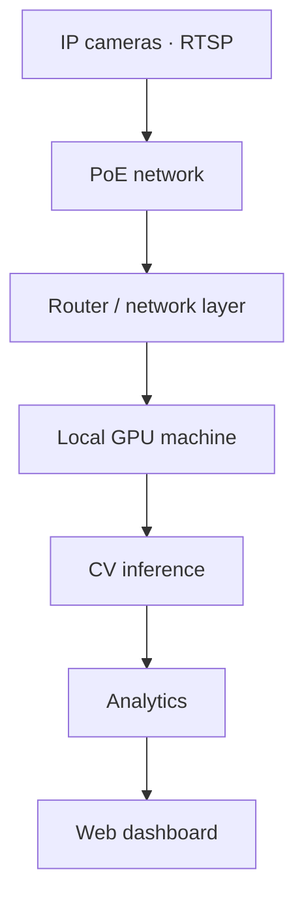

<div align="center">

**A.I.S.E.** &nbsp;·&nbsp; [SYSTEMS](#-system-architecture-modules) &nbsp;·&nbsp; [RESEARCH](#-research-log) &nbsp;·&nbsp; [STACK](#-technology-stack) &nbsp;·&nbsp; [CONTACT](mailto:raiyan2025@gmail.com) &nbsp;&nbsp; `● STATUS: ONLINE`

*INITIALIZING PROFILE*

```
 ____      _    _____   __ _    _   _
|  _ \    / \  |_ _\ \ / // \  | \ | |
| |_) |  / _ \  | | \ V // _ \ |  \| |
|  _ <  / ___ \ | |  | |/ ___ \| |\  |
|_| \_\/_/   \_\___| |_/_/   \_\_| \_|

          A H M E D  ·  AI SYSTEMS
```

> AI Systems Engineer · LLM Infrastructure · Agentic AI · Computer Vision


**Director of Engineering · Senior AI Lead — [The Data Island](https://www.thedataisland.com/)**

I build and deploy AI systems end to end — from GPU-level inference and agent
infrastructure to computer-vision platforms and production applications.
Models are the starting point. What I care about is everything after:
serving, latency, memory, tool use, integration, reliability, production.

[](https://github.com/Raiyan007-gb)
[](https://www.linkedin.com/in/raiyan-ahmed-20488b120/)
[](https://scholar.google.com/citations?user=NjO557sAAAAJ&hl=en)
[](https://arxiv.org/abs/2606.17506)
[](mailto:raiyan2025@gmail.com)
[](https://raiyan007-gb.github.io/Raiyan007-gb/chat.html)

<br>


*Graduate — [North South University](https://www.northsouth.edu/), Dhaka, Bangladesh*

</div>

---

## COMM-LINK // AI INTERFACE `ACTIVE`

> Live interface into everything below. Ask about the work, the stack, the research — streamed, keyless.

<div align="center">

[](https://raiyan007-gb.github.io/Raiyan007-gb/chat.html)

*Click to open — answers stream via OpenRouter through a secure proxy.
Reads live public repo data on demand. No key needed.*

</div>

---

## LIVE TELEMETRY // SYSTEM NODE 01

```text
$ raiyan --status --now
● llm-infra   :: Qwen3.8-27B · vLLM · 256K ctx · BF16 · GPU tuning
● agents      :: Claude Code · MCP/LSP · sub-agents · auto-debug
● production  :: U-LENS · CV platforms · analytics backends
● speech      :: Bangla STT/TTS · Whisper tuning · assistants
● research    :: EMNLP 2026 · efficient inference · multimodal
```

---

## CAPABILITY MATRIX

<table>
<tr>
<td><b>AI Systems</b><br>LLM-powered software, end to end</td>
<td><b>LLM Infrastructure</b><br>Inference, serving, optimization</td>
<td><b>Agentic AI</b><br>Agents that operate software</td>
</tr>
<tr>
<td><b>Computer Vision</b><br>Real-time video, local inference</td>
<td><b>Speech AI</b><br>STT / TTS, Whisper tuning</td>
<td><b>Bangla AI</b><br>AI that works in Bangla, not just English</td>
</tr>
<tr>
<td><b>Backend Engineering</b><br>APIs, data pipelines, scale</td>
<td><b>Full-Stack Systems</b><br>Next.js + FastAPI production apps</td>
<td><b>GPU Computing</b><br>CUDA, Slurm clusters, memory tuning</td>
</tr>
<tr>
<td><b>Research</b><br>EMNLP 2026 · IJCNN 2025 · LLM evaluation</td>
<td><b>Production Infrastructure</b><br>AWS, caching, observability</td>
<td><b>Developer Tooling</b><br>MCP servers, agent skills, CLIs</td>
</tr>
</table>

---

## SYSTEM ARCHITECTURE MODULES

### LLM Inference Pipeline `STABLE`

```bash
MAX_MODEL_LEN=262144   # 256K long-context serving
MAX_NUM_SEQS=32        # concurrent request batching
GPU_UTIL=0.90          # high memory utilization
DTYPE=bfloat16         # BF16 inference
```



I work on the infrastructure side of modern LLMs — not just API calls.
Long-context inference · high-throughput serving · concurrent requests ·
GPU memory optimization · quantization and FP4 experiments · CUDA troubleshooting ·
Slurm-based clusters · large-memory inference environments.

### Agent Loop `ACTIVE`



I build systems where AI interacts with and operates software — not chatbots
around it, but agents inside the loop. Concrete pieces, all open source:

- **[agentmesh](https://github.com/Raiyan007-gb/agentmesh)** — local message bus, task queue and shared memory turning isolated Claude Code / OpenCode sessions into a coordinated multi-agent platform (13 MCP tools).
- **[relays](https://github.com/Raiyan007-gb/relays)** — one canonical `~/.agents` store (Tauri + Rust) wiring MCP servers, skills and plugins into every harness via junctions/symlinks.
- **[skills](https://github.com/Raiyan007-gb/skills)** — Claude Code skill collection: evidence-driven testing, worktree isolation, review loops.
- **[opensrc](https://github.com/Raiyan007-gb/opensrc)** — Rust CLI giving coding agents instant access to any npm/PyPI/crates.io package source.

### Camera-to-Dashboard `ACTIVE`



Real-time video systems with local GPU inference — cameras to dashboard.
Published CV research alongside the production work:

- **[LTIC-Herb](https://github.com/Raiyan007-gb/LTIC-Herb)** (IJCNN 2025) — three-stage transformer classifier for long-tailed herbarium species; SOTA on Herbarium 2021/2022 across few/medium/many-shot splits.

---

## ACTIVE SYSTEMS & DEPLOYMENTS

| System | Function | Stack | Status | Access |
|---|---|---|---|---|
| **Long-context LLM inference** | Qwen3.8-27B served with 262K context, tuned batching and GPU utilization on RTX 6000-class Slurm hardware | vLLM · SGLang · BF16 · CUDA · Slurm | `ACTIVE` | Private infra |
| **U-LENS / UBL Admin Platform** | Production admin portal: dashboards, attendance, POSM inventory + town/CM summaries, SKU reporting, PJP upload, large-scale reporting on live databases | MongoDB aggregation · AWS · S3 · WAF · Firebase · caching | `ACTIVE` | Private production system |
| **AI surveillance / CV platform** | RTSP camera networks → PoE → local GPU inference → analytics → web dashboard; CV/AI lead on enterprise systems | Python · RTSP · GPU inference · dashboards | `ACTIVE` | Private systems |
| **Bangla AI + speech** | Bangla Smart Home Assistant, Bangla STT/TTS research, Whisper fine-tuning, Bangla–English RAG with evaluation | Whisper · FAISS · LangChain · Flask | `ACTIVE` | [rag](https://github.com/Raiyan007-gb/multilingual_rag_system_md._shoaib_ahmed) |
| **Agentic dev environment** | A2S multi-agent message bus + canonical `~/.agents` harness manager (Tauri/Rust) + Claude Code skills + npm-source CLI for coding agents | MCP · Rust · Tauri · Python | `ACTIVE` | [agentmesh](https://github.com/Raiyan007-gb/agentmesh) · [relays](https://github.com/Raiyan007-gb/relays) · [skills](https://github.com/Raiyan007-gb/skills) · [opensrc](https://github.com/Raiyan007-gb/opensrc) |
| **AI Photodrive** | AI-assisted photo/drive platform (API + frontends + Runpod pipelines) | Python · TypeScript · notebooks | `STABLE` | Private system |
| **LTIC-Herb** | 3-stage CLIP-ViT long-tail classifier, SOTA on Herbarium 2021/2022 (IJCNN 2025) | PyTorch · CLIP-ViT · transformers | `STABLE` | [repo](https://github.com/Raiyan007-gb/LTIC-Herb) · [paper](https://ieeexplore.ieee.org/abstract/document/11228538/) |
| **SSH Transfer Pro** | DevOps desktop app: SSH/SFTP browser, Tar/SFTP/SCP engines, native terminal launcher, signed installers | Electron · ssh2 · NSIS | `DEPLOYED` | [repo](https://github.com/Raiyan007-gb/SSH-Transfer-Pro) · [download](https://github.com/Raiyan007-gb/SSH-Transfer-Pro/releases/tag/v2.8.4) |

Additional production areas: Bangla Smart Home Assistant · Bangla speech recognition and Whisper fine-tuning · Bangla STT / TTS research with modern open speech models.

---

## RESEARCH LOG

> **Research accepted at EMNLP 2026.**
>
> **Evaluating Second-Order Bias of LLMs Through Epistemic Entitlement**
> Ramaravind Kommiya Mothilal · Terry Jingchen Zhang · **Raiyan Ahmed** · Zhijing Jin · Shion Guha · Syed Ishtiaque Ahmed
>
> - arXiv: [2606.17506](https://arxiv.org/abs/2606.17506)
> - Code / dataset: *TODO — add links when public*

Related published / prototype research:

| Work | Area | Links |
|---|---|---|
| **LTIC-Herb** — long-tail herbarium classification (IJCNN 2025) | Vision · transformers | [repo](https://github.com/Raiyan007-gb/LTIC-Herb) · [ieee](https://ieeexplore.ieee.org/abstract/document/11228538/) |
| **HAF** — faithfulness of toxicity explanations in LLMs | LLM evaluation | [repo](https://github.com/Raiyan007-gb/HAF) |
| **AmbiGuard** — sandbox for reflective evaluation of AI safety guardrails | AI safety | [repo](https://github.com/Raiyan007-gb/ambiguard) · [demo](https://uofthcdslab.github.io/ambiguard/) |

<details>
<summary><b>Research interests</b></summary>

<br>

Large language models · model architecture · efficient inference · AI systems ·
quantum computing + AI · large-scale deployment · multimodal AI · speech AI.

</details>

---

## TECHNOLOGY STACK

| Layer | Technologies |
|---|---|
| **AI / ML** | PyTorch · Transformers · ONNX · Whisper · vLLM · SGLang · Qwen · OpenRouter |
| **Agents & tooling** | Claude Code · Cursor · OpenCode · MCP · LSP · sub-agent architectures · model routing |
| **Backend** | Python · FastAPI · Flask · Node.js |
| **Frontend** | Next.js · React · TypeScript · Tailwind CSS |
| **Mobile** | Flutter |
| **AI** | LLMs · agents · speech · vision · RAG |
| **Infra & cloud** | Docker · Nginx · AWS (S3 · WAF) · Vercel · Firebase · Slurm · Linux |
| **Data** | MongoDB · large-scale aggregation · caching · batch processing |
| **CV** | RTSP · YOLO · real-time video · local GPU inference · analytics dashboards |

---

## DOCTRINE

I don't just experiment with models. I care about what happens
**after the model works**: deployment, latency, memory, throughput,
tool use, observability, integration, reliability, production.

---

## EVOLUTION PATH

```
Software Engineering
        ↓
       AI / ML
        ↓
  Computer Vision
        ↓
Production AI Systems
        ↓
 LLM Infrastructure
        ↓
    Agentic AI
        ↓
   AI Research
```

---

## TELEMETRY

<div align="center">


<!-- lowlighter/metrics renders (isocalendar + achievements) live in
     .github/workflows/metrics.yml — add a METRICS_TOKEN repo secret and run
     the Metrics workflow, then uncomment:


-->

</div>

---

<div align="center">

```text
END OF TRANSMISSION // SYSTEM OPERATIONAL
```

*Source · Logs · Terminal — all systems above are live links.*

**Building at the intersection of AI × agents × LLM infrastructure × computer vision × production engineering × research.**

</div>
