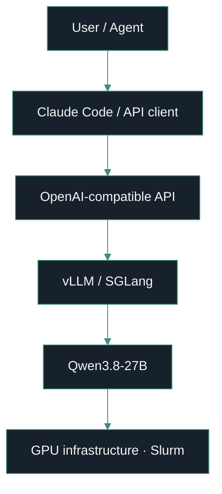
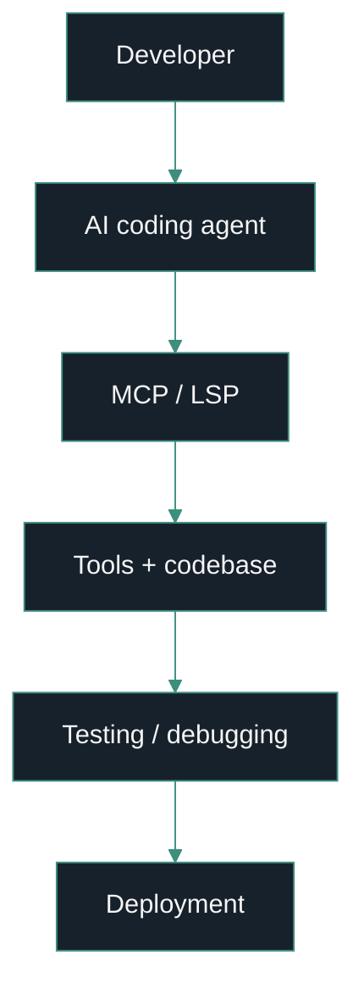
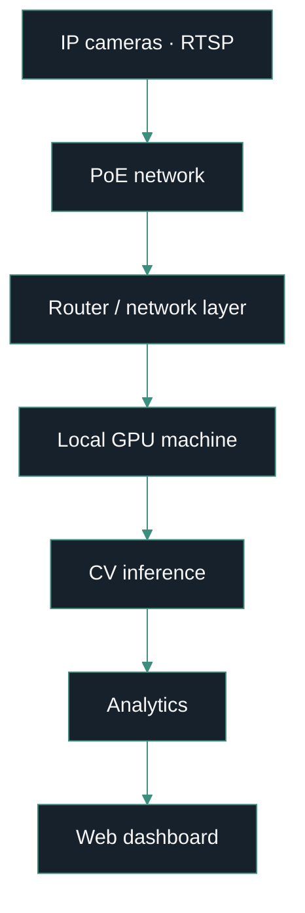

<div align="center">


**Director of Engineering · Senior AI Lead — [The Data Island](https://www.thedataisland.com/)**


*Graduate — [North South University](https://www.northsouth.edu/), Dhaka, Bangladesh*


[](mailto:raiyan2025@gmail.com)
[](https://www.linkedin.com/in/raiyan-ahmed-20488b120/)
[](https://github.com/Raiyan007-gb)
[](https://scholar.google.com/citations?hl=en&user=NjO557sAAAAJ)
[](https://arxiv.org/abs/2606.17506)

</div>

I build AI systems end to end — GPU-level inference, agent infrastructure, computer-vision platforms, and the production applications wrapped around them. Models are the easy part. The work I actually care about starts after: serving, latency, memory, tool use, integration, reliability — the parts that decide whether something survives contact with real traffic.

<div align="center">

[](https://raiyan007-gb.github.io/Raiyan007-gb/chat.html)

*Open the live AI interface to ask about the work below — it reads this repo's public data on request, no API key needed.*

</div>

> **Everything after the model works is the actual job.**

## What I do

<table width="100%">
<tr align="center">
<td width="25%">

**🧠 AI Systems**

<sub>LLM-powered software, end to end</sub>

</td>
<td width="25%">

**⚙️ LLM Infrastructure**

<sub>Inference, serving, optimization</sub>

</td>
<td width="25%">

**🤖 Agentic AI**

<sub>Agents that operate software</sub>

</td>
<td width="25%">

**👁️ Computer Vision**

<sub>Real-time video, local inference</sub>

</td>
</tr>
<tr align="center">
<td>

**🎙️ Speech AI**

<sub>STT / TTS, Whisper tuning</sub>

</td>
<td>

**💬 Bangla AI**

<sub>AI that works in Bangla, not just English</sub>

</td>
<td>

**🔧 Backend Engineering**

<sub>APIs, data pipelines, scale</sub>

</td>
<td>

**🖥️ Full-Stack Systems**

<sub>Next.js + FastAPI production apps</sub>

</td>
</tr>
<tr align="center">
<td>

**⚡️ GPU Computing**

<sub>CUDA, Slurm clusters, memory tuning</sub>

</td>
<td>

**🔬 Research**

<sub>EMNLP 2026 · IJCNN 2025 · LLM evaluation</sub>

</td>
<td>

**☁️ Production Infrastructure**

<sub>AWS, caching, observability</sub>

</td>
<td>

**🧰 Developer Tooling**

<sub>MCP servers, agent skills, CLIs</sub>

</td>
</tr>
</table>

## Currently

- Tuning 256K-context serving for Qwen3.8-27B across Slurm-managed GPU nodes
- Building shared infrastructure for coding agents — message bus, config store, skills — across Claude Code and OpenCode
- Fine-tuning Whisper and building Bangla–English RAG for Bangla speech and language AI
- Running CV analytics on live RTSP camera networks for enterprise deployments
- Co-author on an EMNLP 2026 paper on second-order bias in LLM epistemic judgments

<!-- Highlights: featured project cards. Pull each project's own logo straight from its
     repo (assets/logo.svg, assets/logo.png, or an icon referenced in its README) when one
     exists; if a project has no logo, drop the image and keep the text cell. Update the set
     as work progresses — swap in newer pushes, or feature a project worth calling out. -->
## Highlights

*What I've pushed to most recently — plus a few worth calling out.*

<table>
<tr>
<td width="33%" valign="top">


**[dsh-remote-tunnel-easy](https://github.com/Raiyan007-gb/dsh-remote-tunnel-easy)**

QR-code remote handoff for DeepSeek Harness: scan a code in Settings and your phone opens the same live session through a Cloudflare quick tunnel, no database, no app install. `v1.4.2`

</td>
<td width="33%" valign="top">


**[relays](https://github.com/Raiyan007-gb/relays)**

One canonical `~/.agents` store for every AI harness — Claude Code, Cursor, Codex, OpenCode, Kiro — wired into each via junctions/symlinks from a single Tauri desktop app. In active development.

</td>
<td width="33%" valign="top">


**[SSH Transfer Pro](https://github.com/Raiyan007-gb/SSH-Transfer-Pro)**

Dark, keyboard-friendly Electron workstation for moving files over SSH: drill into a remote server, exclude what you don't need, then pull it down via Tar streaming, SFTP, or SCP — plus a one-click native terminal and OS-keychain credential storage. `v2.8.4`

</td>
</tr>
</table>

## Flagship systems

### Long-context LLM inference

```bash
MAX_MODEL_LEN=262144   # 256K long-context serving
MAX_NUM_SEQS=32         # concurrent request batching
GPU_UTIL=0.90           # high memory utilization
DTYPE=bfloat16          # BF16 inference
```



I work on the infrastructure side of modern LLMs, not just API calls: long-context inference, high-throughput serving, concurrent request batching, GPU memory optimization, quantization and FP4 experiments, CUDA troubleshooting, Slurm-based clusters, large-memory inference environments.

### Agent loop



I build systems where AI interacts with and operates software, not chatbots around it, but agents inside the loop:

- **[agentmesh](https://github.com/Raiyan007-gb/agentmesh)** — local message bus, task queue and shared memory turning isolated Claude Code / OpenCode sessions into a coordinated multi-agent platform (13 MCP tools)
- **[relays](https://github.com/Raiyan007-gb/relays)** — one canonical `~/.agents` store (Tauri + Rust) wiring MCP servers, skills and plugins into every harness via junctions/symlinks
- **[skills](https://github.com/Raiyan007-gb/skills)** — Claude Code skill collection: evidence-driven testing, worktree isolation, review loops
- **[opensrc](https://github.com/Raiyan007-gb/opensrc)** — Rust CLI giving coding agents instant access to any npm/PyPI/crates.io package source

### Camera-to-dashboard



Real-time video systems with local GPU inference, cameras to dashboard. Published CV research alongside the production work:

- **[LTIC-Herb](https://github.com/Raiyan007-gb/LTIC-Herb)** (IJCNN 2025) — three-stage transformer classifier for long-tailed herbarium species; state of the art on Herbarium 2021/2022 across few/medium/many-shot splits

## Systems I build and run

| System | Function | Stack | Status | Access |
|---|---|---|---|---|
| Long-context LLM inference | Qwen3.8-27B served with 262K context, tuned batching and GPU utilization on RTX 6000-class Slurm hardware | vLLM · SGLang · BF16 · CUDA · Slurm | 🟢 Active | Private infra |
| U-Lens / UBL Admin Platform | Production admin portal: dashboards, attendance, POSM inventory + town/CM summaries, SKU reporting, PJP upload, large-scale reporting on live databases | MongoDB aggregation · AWS · S3 · WAF · Firebase · caching | 🟢 Active | Private production system |
| AI surveillance / CV platform | RTSP camera networks → PoE → local GPU inference → analytics → web dashboard; CV/AI lead on enterprise systems | Python · RTSP · GPU inference · dashboards | 🟢 Active | Private systems |
| Bangla AI & speech | Bangla Smart Home Assistant, Bangla STT/TTS research, Whisper fine-tuning, Bangla–English RAG with evaluation | Whisper · FAISS · LangChain · Flask | 🟢 Active | [repo](https://github.com/Raiyan007-gb/multilingual_rag_system_md._shoaib_ahmed) |
| Agentic dev environment | A2S multi-agent message bus + canonical `~/.agents` harness manager (Tauri/Rust) + Claude Code skills + npm-source CLI for coding agents | MCP · Rust · Tauri · Python | 🟢 Active | [agentmesh](https://github.com/Raiyan007-gb/agentmesh) · [relays](https://github.com/Raiyan007-gb/relays) · [skills](https://github.com/Raiyan007-gb/skills) · [opensrc](https://github.com/Raiyan007-gb/opensrc) |
| AI Photodrive | AI-assisted photo/drive platform (API + frontends + Runpod pipelines) | Python · TypeScript · notebooks | 🔵 Stable | Private system |
| LTIC-Herb | 3-stage CLIP-ViT long-tail classifier, SOTA on Herbarium 2021/2022 (IJCNN 2025) | PyTorch · CLIP-ViT · transformers | 🔵 Stable | [repo](https://github.com/Raiyan007-gb/LTIC-Herb) · [paper](https://ieeexplore.ieee.org/abstract/document/11228538/) |
| SSH Transfer Pro | DevOps desktop app: SSH/SFTP browser, Tar/SFTP/SCP engines, native terminal launcher, signed installers | Electron · ssh2 · NSIS | ⚪ Deployed | [repo](https://github.com/Raiyan007-gb/SSH-Transfer-Pro) · [download](https://github.com/Raiyan007-gb/SSH-Transfer-Pro/releases/tag/v2.8.4) |

Additional production areas: Bangla Smart Home Assistant · Bangla speech recognition and Whisper fine-tuning · Bangla STT/TTS research with modern open speech models.

## Research

> **Evaluating Second-Order Bias of LLMs Through Epistemic Entitlement** — accepted, EMNLP 2026
> Ramaravind Kommiya Mothilal, Terry Jingchen Zhang, **Raiyan Ahmed**, Zhijing Jin, Shion Guha, Syed Ishtiaque Ahmed
> [arXiv:2606.17506](https://arxiv.org/abs/2606.17506) · code and dataset: pending publication

| Work | Area | Links |
|---|---|---|
| LTIC-Herb — long-tail herbarium classification (IJCNN 2025) | Vision · transformers | [repo](https://github.com/Raiyan007-gb/LTIC-Herb) · [IEEE](https://ieeexplore.ieee.org/abstract/document/11228538/) |
| HAF — faithfulness of toxicity explanations in LLMs | LLM evaluation | [repo](https://github.com/Raiyan007-gb/HAF) |
| AmbiGuard — sandbox for reflective evaluation of AI safety guardrails | AI safety | [repo](https://github.com/Raiyan007-gb/ambiguard) · [demo](https://uofthcdslab.github.io/ambiguard/) |

<details>
<summary>Research interests</summary>
<br>

Large language models, model architecture, efficient inference, AI systems, quantum computing and AI, large-scale deployment, multimodal AI, speech AI.

</details>

## Stack

**AI / ML**
       

**Agents & tooling**
    

**Backend & data**
    

**Frontend & mobile**
    

**Infra & cloud**
      

*(AWS here spans S3 and WAF · U-Lens also layers in request caching on top of MongoDB aggregation.)*

**Computer vision** — YOLO · RTSP · real-time video pipelines · local GPU inference

## Philosophy

I don't just experiment with models. I care about what happens after the model works: deployment, latency, memory, throughput, tool use, observability, integration, reliability, production.

## Evolution


## GitHub activity

<div align="center">


</div>

<!-- lowlighter/metrics renders (isocalendar + achievements) live in
     .github/workflows/metrics.yml — add a METRICS_TOKEN repo secret and run
     the Metrics workflow, then uncomment:


-->

---

<div align="center">


Building at the intersection of AI systems, LLM infrastructure, agentic tooling, computer vision, and production engineering.

</div>
