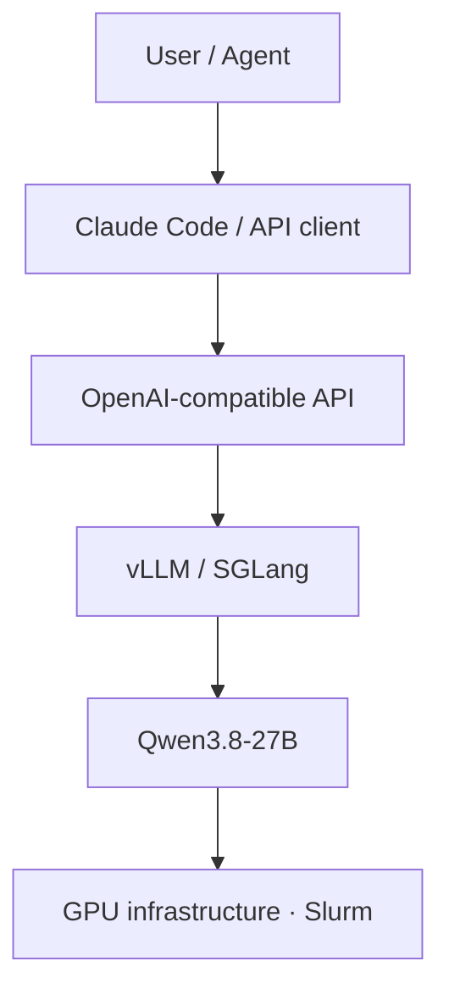
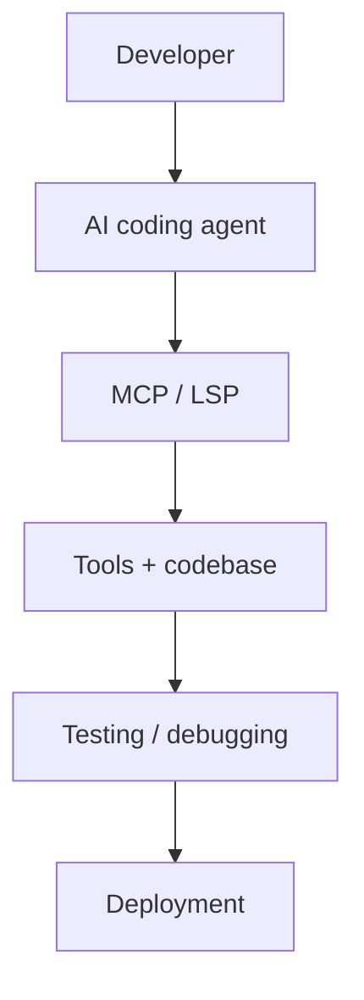
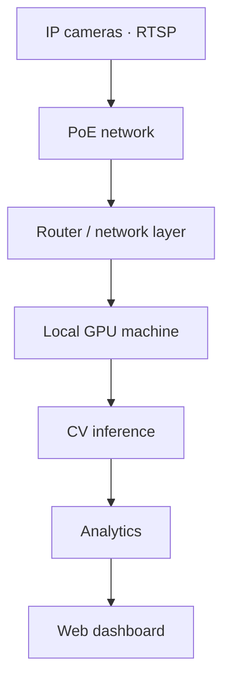

<div align="center">

# Raiyan Ahmed

**AI Systems Engineer · LLM Infrastructure · Agentic AI · Computer Vision**

I build and deploy AI systems end to end — from GPU-level inference and agent
infrastructure to computer-vision platforms and production applications.
Models are the starting point. What I care about is everything after:
serving, latency, memory, tool use, integration, reliability, production.

[](https://github.com/Raiyan007-gb)
[](https://www.linkedin.com/)
[](https://2026.emnlp.org/)
[](mailto:raiyan2025@gmail.com)

*LinkedIn / portfolio links are placeholders — replace with exact URLs.*

</div>

---

## Currently Building

| # | Track | Focus |
|---|-------|-------|
| **01** | **Long-context LLM infrastructure** | Qwen3.8-27B on vLLM · 200K+ context · BF16 · GPU memory optimization |
| **02** | **Agentic development** | Claude Code · MCP · LSP · sub-agents · autonomous debugging workflows |
| **03** | **Production AI systems** | Enterprise AI · computer vision · analytics · backend platforms |
| **04** | **Bangla AI** | Speech recognition · TTS · intelligent assistants |
| **05** | **AI research** | EMNLP 2026 and continued work on modern AI systems |

---

## Engineering Focus

<table>
<tr>
<td><b>AI Systems</b><br>LLM-powered software, end to end</td>
<td><b>LLM Infrastructure</b><br>Inference, serving, optimization</td>
<td><b>Agentic AI</b><br>Agents that operate software</td>
</tr>
<tr>
<td><b>Computer Vision</b><br>Real-time video, local inference</td>
<td><b>Speech AI</b><br>STT / TTS, Whisper tuning</td>
<td><b>Bangla AI</b><br>AI that works in Bangla, not just English</td>
</tr>
<tr>
<td><b>Backend Engineering</b><br>APIs, data pipelines, scale</td>
<td><b>Full-Stack Systems</b><br>Next.js + FastAPI production apps</td>
<td><b>GPU Computing</b><br>CUDA, Slurm clusters, memory tuning</td>
</tr>
<tr>
<td><b>Research</b><br>EMNLP 2026 · IJCNN 2025 · LLM evaluation</td>
<td><b>Production Infrastructure</b><br>AWS, caching, observability</td>
<td><b>Developer Tooling</b><br>MCP servers, agent skills, CLIs</td>
</tr>
</table>

---

## Featured Work

| Project | What it is | Stack | Status | Links |
|---|---|---|---|---|
| **Long-context LLM inference** | Qwen3.8-27B served with 262K context, tuned batching and GPU utilization on RTX 6000-class Slurm hardware | vLLM · SGLang · BF16 · CUDA · Slurm | Active R&D | Private infra |
| **U-LENS / UBL Admin Platform** | Production admin portal: dashboards, attendance, POSM inventory + town/CM summaries, SKU reporting, PJP upload, large-scale reporting on live databases | MongoDB aggregation · AWS · S3 · WAF · Firebase · caching | Production | [module](https://github.com/Raiyan007-gb/u-lens-salary-module) |
| **AI surveillance / CV platform** | RTSP camera networks → PoE → local GPU inference → analytics → web dashboard; CV/AI lead on enterprise systems | Python · RTSP · GPU inference · dashboards | Production | Private systems |
| **Bangla AI + speech** | Bangla Smart Home Assistant, Bangla STT/TTS research, Whisper fine-tuning, Bangla–English RAG with evaluation | Whisper · FAISS · LangChain · Flask | Active R&D | [rag](https://github.com/Raiyan007-gb/multilingual_rag_system_md._shoaib_ahmed) |
| **Agentic dev environment** | A2S multi-agent message bus + canonical `~/.agents` harness manager (Tauri/Rust) + Claude Code skills + npm-source CLI for coding agents | MCP · Rust · Tauri · Python | Active | [agentmesh](https://github.com/Raiyan007-gb/agentmesh) · [relays](https://github.com/Raiyan007-gb/relays) · [skills](https://github.com/Raiyan007-gb/skills) · [opensrc](https://github.com/Raiyan007-gb/opensrc) |
| **AI Photodrive** | AI-assisted photo/drive platform (API + frontends + Runpod pipelines) | Python · TypeScript · notebooks | Production | Private system |
| **LTIC-Herb** | 3-stage CLIP-ViT long-tail classifier, SOTA on Herbarium 2021/2022 (IJCNN 2025) | PyTorch · CLIP-ViT · transformers | Published | [repo](https://github.com/Raiyan007-gb/LTIC-Herb) |
| **SSH Transfer Pro** | DevOps desktop app: SSH/SFTP browser, Tar/SFTP/SCP engines, native terminal launcher, signed installers | Electron · ssh2 · NSIS | Released | [repo](https://github.com/Raiyan007-gb/SSH-Transfer-Pro) · [download](https://github.com/Raiyan007-gb/SSH-Transfer-Pro/releases/tag/v2.8.4) |

---

## LLM Infrastructure

I work on the infrastructure side of modern LLMs — not just API calls.

```bash
MAX_MODEL_LEN=262144   # 256K long-context serving
MAX_NUM_SEQS=32        # concurrent request batching
GPU_UTIL=0.90          # high memory utilization
DTYPE=bfloat16         # BF16 inference
```



Areas: long-context inference · high-throughput serving · concurrent requests ·
GPU memory optimization · quantization and FP4 experiments · CUDA troubleshooting ·
Slurm-based clusters · large-memory inference environments.

---

## Agentic AI

I build systems where AI interacts with and operates software — not chatbots
around it, but agents inside the loop.



Concrete pieces, all open source:

- **[agentmesh](https://github.com/Raiyan007-gb/agentmesh)** — local message bus, task queue and shared memory turning isolated Claude Code / OpenCode sessions into a coordinated multi-agent platform (13 MCP tools).
- **[relays](https://github.com/Raiyan007-gb/relays)** — one canonical `~/.agents` store (Tauri + Rust) wiring MCP servers, skills and plugins into every harness via junctions/symlinks.
- **[skills](https://github.com/Raiyan007-gb/skills)** — Claude Code skill collection: evidence-driven testing, worktree isolation, review loops.
- **[opensrc](https://github.com/Raiyan007-gb/opensrc)** — Rust CLI giving coding agents instant access to any npm/PyPI/crates.io package source.

---

## Computer Vision

Real-time video systems with local GPU inference — cameras to dashboard.



Published CV research alongside the production work:

- **[LTIC-Herb](https://github.com/Raiyan007-gb/LTIC-Herb)** (IJCNN 2025) — three-stage transformer classifier for long-tailed herbarium species; SOTA on Herbarium 2021/2022 across few/medium/many-shot splits.

---

## Bangla AI

AI systems that work in Bangla — speech first.

- Bangla Smart Home Assistant
- Bangla speech recognition · Whisper fine-tuning
- Bangla STT / TTS research with modern open speech models
- [Bangla–English RAG with evaluation](https://github.com/Raiyan007-gb/multilingual_rag_system_md._shoaib_ahmed) (FAISS · LangChain)

---

## Research

> **Research accepted at EMNLP 2026.**
>
> - Paper title: *TODO — fill in exact title*
> - Paper link: *TODO*
> - arXiv: *TODO*
> - Code: *TODO*
> - Dataset: *TODO*

Related published / prototype research:

| Work | Area | Links |
|---|---|---|
| **LTIC-Herb** — long-tail herbarium classification (IJCNN 2025) | Vision · transformers | [repo](https://github.com/Raiyan007-gb/LTIC-Herb) |
| **HAF** — faithfulness of toxicity explanations in LLMs | LLM evaluation | [repo](https://github.com/Raiyan007-gb/HAF) |
| **AmbiGuard** — sandbox for reflective evaluation of AI safety guardrails | AI safety | [repo](https://github.com/Raiyan007-gb/ambiguard) · [demo](https://uofthcdslab.github.io/ambiguard/) |

<details>
<summary><b>Research interests</b></summary>

<br>

Large language models · model architecture · efficient inference · AI systems ·
quantum computing + AI · large-scale deployment · multimodal AI · speech AI.

</details>

---

## Stack

| Layer | Technologies |
|---|---|
| **AI / ML** | PyTorch · Transformers · ONNX · Whisper · vLLM · SGLang · Qwen · OpenRouter |
| **Agents & tooling** | Claude Code · Cursor · OpenCode · MCP · LSP · sub-agent architectures · model routing |
| **Backend** | Python · FastAPI · Flask · Node.js |
| **Frontend** | Next.js · React · TypeScript · Tailwind CSS |
| **Infra & cloud** | Docker · Nginx · AWS (S3 · WAF) · Vercel · Firebase · Slurm · Linux |
| **Data** | MongoDB · large-scale aggregation · caching · batch processing |
| **CV** | RTSP · real-time video · local GPU inference · analytics dashboards |

---

## Engineering Philosophy

I don't just experiment with models. I care about what happens
**after the model works**: deployment, latency, memory, throughput,
tool use, observability, integration, reliability, production.

---

## Evolution

```
Software Engineering
        ↓
       AI / ML
        ↓
  Computer Vision
        ↓
Production AI Systems
        ↓
 LLM Infrastructure
        ↓
    Agentic AI
        ↓
   AI Research
```

---

## Activity

<div align="center">


</div>

---

<div align="center">

**Building at the intersection of AI × agents × LLM infrastructure × computer vision × production engineering × research.**

</div>
